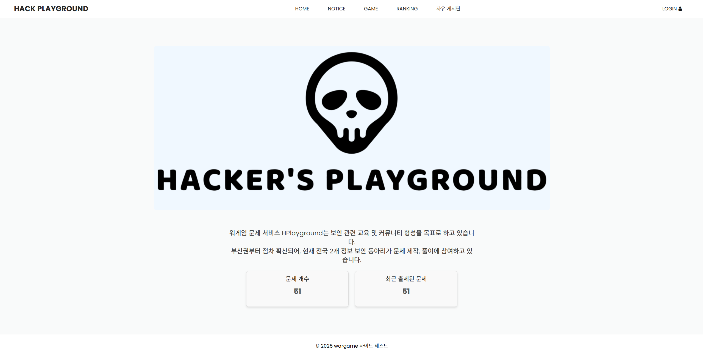
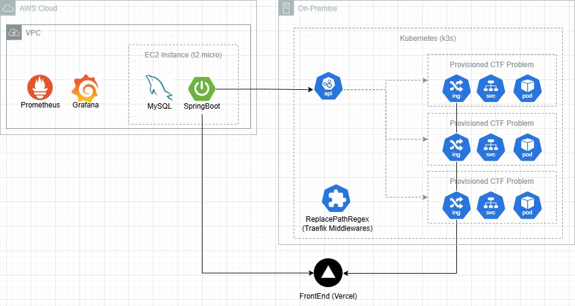

# Hack PlayGound - CTF 문제 풀이 서비스



Hack-PlayGround는 VM 기반 서비스의 비용 부담을 해결해서 국내 정보보안 교육의 폭을 넓히고자 시작한 문제풀이 서비스입니다.

<br>

컨테이너 기반 기술로 문제를 관리하여 모니터링이나 관리도 용이하며 운영 비용도 VM 기반에 비해 개선했습니다.

<br>

특히 기존 D사 서비스의 유료화 정책으로 보안 교육이 위축됨을 염려하여, 저희 서비스를 통해서 **정보 보안 동아리들의 자발적인 참여를 장려**하고 문제 제작 및 풀이, CTF 대회 개최 등 커뮤니티를 형성할 수 있도록 기대하고 있습니다.

<br>

문제 풀이에 치중된 기존 서비스의 대체제가 아니라, 보안을 배우는 학생들이 스스로 주도하는 교육 커뮤니티로 정보보안 교육의 접근성을 넓히고 **자율적인 학습, 문제를 공유하는 생태계 조성을 최종 목표**로 생각하고 있습니다.

현재 부산권 정보보안 동아리들을 중심으로 문제 제작에 함께 참여하고 있습니다.


<br>

**운영비 제로를 목표로 하는 현 시점에서 200개의 문제를 무리없이 운영**할 수 있습니다.

- 서버 스펙 - CPU: Intel i7-1165G7(4Core), RAM: 16GB (On-premise)
- 컨테이너 기반 기술의 성격상, Kernel/Exploit-heavy, Full VM 문제 종류는 제외했습니다.

<br>


## Service Architecture


기술 스택 : Java 21, Spring Boot, Spring Security, Spring Data JPA, MySQL, QueryDSL, Kubernetes Client, Prometheus, Grafana 

<br>

사용자의 문제 풀이시, 동적으로 문제 컨테이너를 생성해서 접속합니다.

내부적으로 Kubernetes 상에서 Pod Garbage Collection 구축해서 컨테이너 리소스 관리 문제를 해결했습니다.

스케줄러를 통해 해당 분야의 namespace를 탐색, Pod별로 아타셰가 임시 볼륨에 기록한 기록을 읽어서 **사용자가 실제 문제를 푸는 중인지 판별**합니다.


<br>

Attache 사이드카
- 분야별 전문 외교관이라는 의미로, Service의 사이드카 Envoy(전권 대사)에서 차용한 애플리케이션
- Go 언어로 Kubernetes SideCar 패턴에 맞춰 구현했습니다. (pcap)
- 문제별 Pod 내부에서 실행되는 메인 컨테이너로 접근하는 TCP 요청(SSH, HTTP 등)을 탐지하고 timestamp를 기록합니다.


<br>


## 구현한 기능

**효율적인 리소스 활용을 위한 자체 Pod Garbage Collection 설계**

해결 과정 : 자체적인 Pod Garbage Collection를 구축하여 리소스 낭비를 최소화
- 문제 생성 이후로 일정 기간동안 사용자의 접근이 없는 경우 삭제하는 Pod GC 스케줄링 설계
  - Pod별로 들어오는 TCP 패킷의 연결을 확인하고 timestamp를 기록하는 사이드카 컨테이너 방식
- 문제별 컨테이너마다 제한된 CPU/RAM 리소스 제한 적용

처리 결과 : 현재 온프레미스 환경(CPU: Core, RAM: GB)의 ks와 백엔드(t.micro)에서 운영비 제로로 서비스 배포
  - 타사와 동일 규모로 비교했을때 클라우드 이전시 운영비용 $/month (약 1,380,000원) 이하로 추산
  - 24시간동안 동시에 실행되는 문제 컨테이너 비율 5%, 각 문제별 필요 리소스 평균 CPU 0.5 Core, RAM MB 가정

<br>

**SQL 쿼리문 튜닝을 통한 성능 개선 시도**

문제 상황 : 검수된 문제들의 목록을 조회하는 로직에 대하여 부하 테스트 수행시 1초 이상 Latency 발생
- 테스트 환경 : 100,000건의 더미 데이터, JMeter를 사용한 2000명의 동시 요청

해결 방안 : 쿼리문 실행계획을 직접 비교하면서 데이터베이스 튜닝으로 Latency 13배 개선, TPS 3배 증가
- 원본 쿼리는 JOIN, GROUP BY를 먼저 수행하여 LIMIT 이후에도 Full Table Scan 및 JOIN 연산이 발생하는 구조
- LIMIT을 우선적으로 적용하여 불필요한 조인 생략, 선택도가 높은 컬럼을 인덱스 우선 순위로 둬서 정렬 생략
- 비즈니스에 필요한 컬럼만 가져오는 DTO Projection을 QueryDSL로 구현하여 SELECT절 최적화

<br>

**가상 쓰레드 도입으로 인한 HikariCP Connection 고갈 문제**

문제 상황 : JDK 21의 가상 쓰레드 도입으로 더 많은 요청을 동시에 처리하여 Latency 개선을 기대했지만 실제 성능 저하됨
- JBCD Connection이 Blocking I/O 작업이라 HikariCP를 빠르게 소진하면서 지연 발생

해결 방안 : HikariCP의 Pool 사이즈 조절 등 성능 튜닝으로 동일한 실험에서 Connection의 평균 대기 시간 25% 개선

<br>

**Spring Data JPA의 N+ 문제 해결**

문제 상황 : 엔티티의 연관관계 설정으로 개별적인 SELECT 쿼리문이 발생

해결 방안 : Join Fetch를 적용하여 쿼리문 하나에 관련 엔티티도 함께 조회하여 N+ 문제를 해결
- 연관 엔티티의 개수가 적은 비즈니스임을 고려하여 Join Fetch 도입 결정
- BatchSize 방식과 성능 비교시 평균 Latency 41%, TPS 39% 개선

<br>

---


## 초기 기획 단계 문서
처음에는 ECR 이미지를 ECS-Fargate로 실행하는 방식으로 지원자 채점을 자동화하는 기업 과제 전형 코딩테스트 서비스를 기획했었다.

방향성을 새로 잡게 되었지만, 컨테이너 기반 기술을 응용해서 알고리즘 문제풀이나 과제전형 문제 출제 및 평가 서비스로도 확장할 수 있다. 

<br>

### Business Flow

1. 과제 참여자의 과제 제출시 Github Repository를 Clone
2. 컨테이너 이미지로 빌드하여 ECR에 Push, Kubernetes 환경에서 프로비저닝
3. 입력값을 평가해서 데이터베이스에 사용자의 결과를 기록

<br>

### User Role

**문제 출제자** :

과제 내용에 해당하는 문제 내용을 필수적으로 작성해야한다. (과제 케이스, 제출 기한 등)

기본적으로 제공해야하는 템플릿이 존재하는 경우 Github Repository를 함께 제공해서 참여자가 Clone할 수 있도록 해야한다.


- [ ] 선택 - `Google SMTP Mail`을 이용해서 `identifier Id` 인증된 사용자만 접속
- [ ] 과제 참여자들의 현황 모니터링

<br>

**과제 참여자** :

문제 유형에 따라 회고록이나 느낀점, 제출할 Git 주소를 동봉해서 제출해야한다.

- [x] 해당 과제 열람, 제출하기, 과제 수정하기 (제출 기한 이내인 경우)
- [ ] 해당 참여자가 진행중인 과제 현황 (제출한 과제, 미제출한 과제 - 남은 제출 기한)
- [ ] `A third-party Github application`로 사용자의 Github에 간편하게 접근

<br>

### Assignment Case
문제 출제자는 여러 개의 입력값에 따른 결과값을 미리 제공해야한다.
- [x] 각 종류별 케이스에 따른 가중치도 문제 출제자가 지정할 수 있다.

<br>

문제의 케이스 종류는 히든, 평가, 예제로 구분된다.
- [x] 과제 참여자가 점수를 볼 수 있는 예제 케이스
   - 문제 형태에 맞춰서 잘 제출되었는지 확인하는 용도 
- [x] 실제 평가를 위한 평가, 히든 케이스

<br>

**format**

```jsx
[
    {
        "kind": "HIDDEN",
        "input": ["inputCase1","inputCase2"],
        "expectedOutput": ["expectedOutput1 \n expectedOutput2","expectedOutput3"],
        "bias": 30
    },
    {
        "kind": "HIDDEN",
        "input": ["inputCase3","inputCase4"],
        "expectedOutput": ["expectedOutput4","expectedOutput5"],
        "bias": 20
    }
]
```

각 케이스의 유형별로 가중치 합에 대한 비를 계산해야한다.

위 예시의 경우는 각 가중치가 3:2로 전체 문제에서 60%, 40% 비율을 차지해야한다.


<br>
